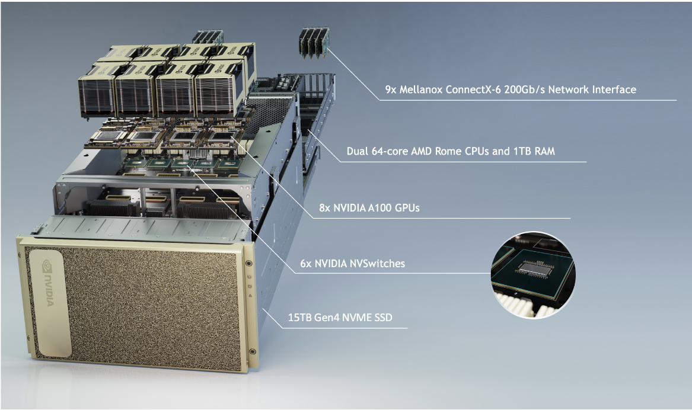

# About the DGX A100

- **GPU**: 40GB per GPU/320 GB per DGX A100 Node
- **CPU**: 2-socket, 128 core AMD Rome 7742, 2.25 GHz (base), 3.4GHz (Max boost)
- **System Memory**: 1 TB 3200 MHz DDR4.
- **Storage:** 
    - **Default**: 15TB (4x3.84TB gen4 NVME).
    - **Purchased with this machine**: 105 TB drive [PNY 3S-1050](https://www.scan.co.uk/3xs/configurator/3s-1050) AI-optimised storage.
    

