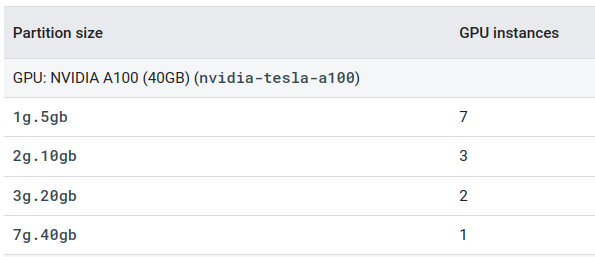
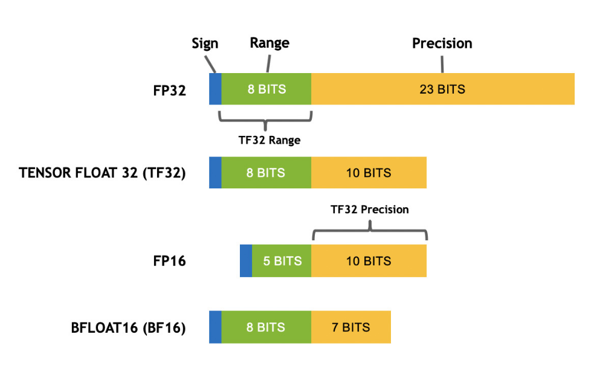

# About the DGX A100

## References
- [DGX A100 white paper](https://images.nvidia.com/aem-dam/en-zz/Solutions/data-center/dgx-a100/dgxa100-system-architecture-white-paper.pdf)
- [Nvidia A100 Tensor Core GPU paper](https://images.nvidia.com/aem-dam/en-zz/Solutions/data-center/nvidia-ampere-architecture-whitepaper.pdf)
- [MIG user guide from Nvidia](https://docs.nvidia.com/datacenter/tesla/mig-user-guide/)

## Hardware
- **GPU**: 40GB per GPU/320 GB per DGX A100 Node
- **CPU**: 2-socket, 128 core AMD Rome 7742, 2.25 GHz (base), 3.4GHz (Max boost)
- **System Memory**: 1 TB 3200 MHz DDR4.
- **Storage:** 
    - **Default**: 15TB (4x3.84TB gen4 NVME).
    - **Purchased with this machine**: 105 TB drive [PNY 3S-1050](https://www.scan.co.uk/3xs/configurator/3s-1050) AI-optimised storage.
    


## Multiple instance GPU
The new Multi-Instance GPU (MIG) feature allows GPUs (starting with NVIDIA Ampere architecture) to be securely partitioned into up to seven separate GPU Instances for CUDA applications, providing multiple users with separate GPU resources for optimal GPU utilization. This feature is particularly beneficial for workloads that do not fully saturate the GPU's compute capacity and therefore users may want to run different workloads in parallel to maximize utilization. 



To examine the particular partitioning scheme implemented on the DGX, run (from _outside_ of a Docker container)

```bash
nvidia-smi
```

The partitioning must be conducted by an administrator (Alejandro or Kattia) and is to be refined according to the users' needs.

**Note:** One drawback of this feature is that each process can only see a single MIG device. Therefore, even if we allocate e.g. two MIG devices, a given process is not able to use the combined power of the two devices.

## Half-precision floating point
- Uses 16-bit representations for floating point number. Default is usually 32 bits.
- Saves memory.
- Speeds up computation.
- Feature also available in Nvidia V100 GPUs (ARC4, Bede, JADE2)
- _Not_ available on P100 or K80 GPUs (ARC3).


