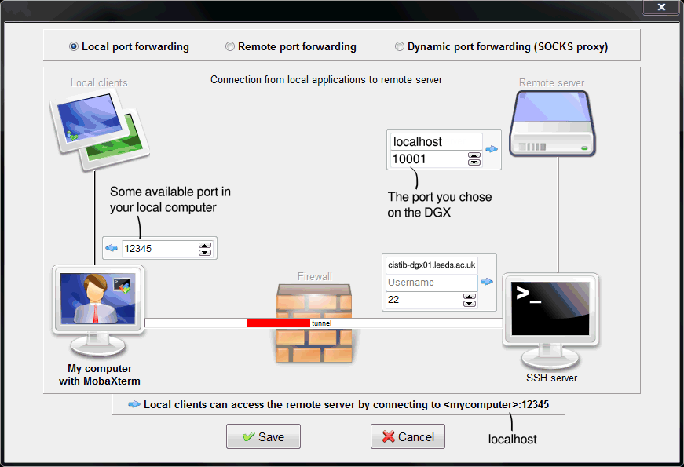

# SSH tunneling
If we want to use e.g. a web interface for a service running on a container, we will need to do SSH tunneling (also known as _port forwarding_).

### On MobaXterm (Windows)
Press the **Tunneling** button, and add a new SSH tunnel (using "Local port forwarding").

